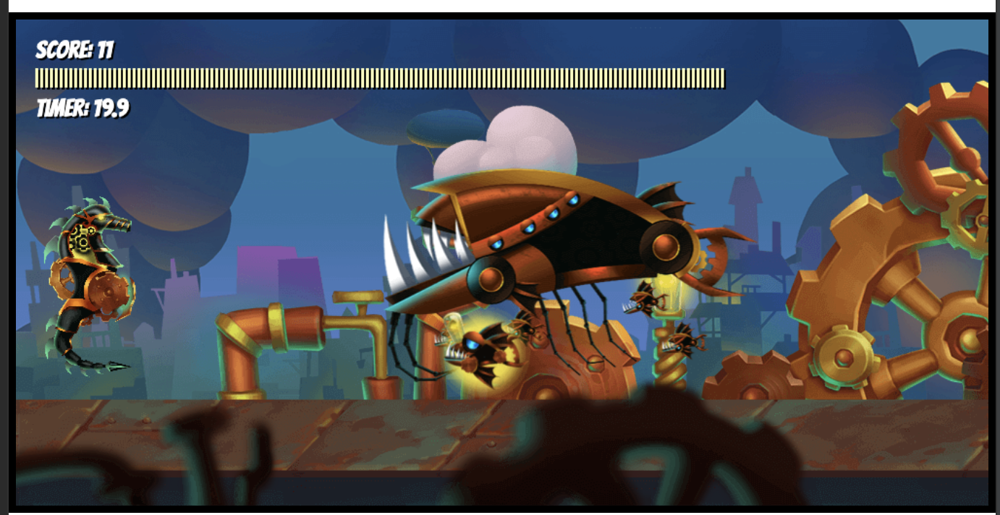
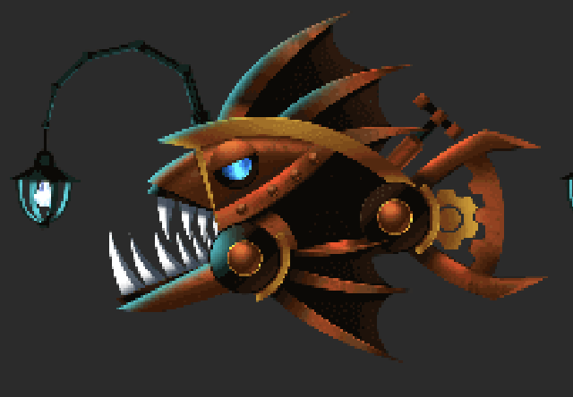
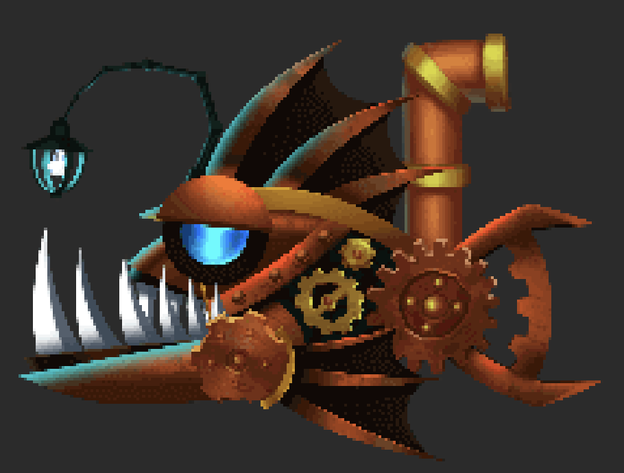
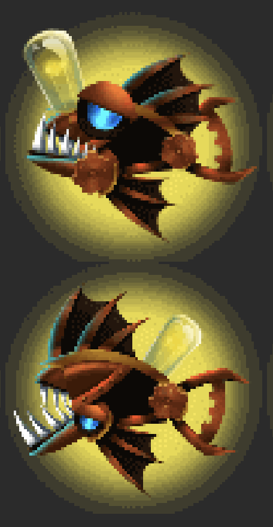
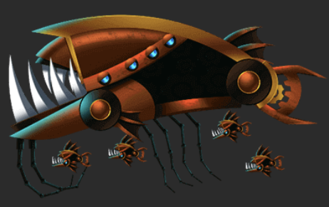
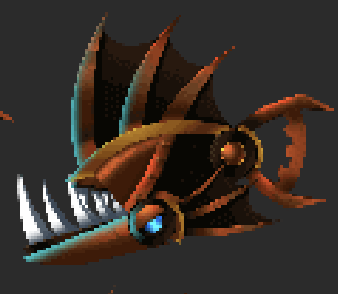

# 2D Canvas Alien Game
This repo contains the source code for a 2D Alien Shooter Game. All that was needed
was HTML, CSS, and Javascript. No frameworks needed. The game and most of its code came from
me coding along to the following YouTube video from freeCodeCamp.org: https://www.youtube.com/watch?v=7BHs1BzA4fs.

## Game Rules

The rules are simple. You play as a Mechanical Seahorse that can move up and down. Destroy your enemies as they approach you with your Seahorse's ammunition. 
You gain points for each enemy that is destroyed, and the amount of points you get depends on the type of enemy you destroy. You lose points
when your enemy hits you. You have 30 seconds to get  100 points, can you do it?

### Point System
- Destroy Angler1: 5 points
- Destroy Angular2: 6 points
- Destroy Lucky Fish: 15 points
- Destroy Hive Whale: 20 points
- Destroy Drone: 3 points
- Collide with enemy (except Lucky Fish): -1 point

### Enemies

#### Angler 1:
  - Health: 5
  - Points: 5

#### Angler 2:
  - Health: 6
  - Points: 6

#### Lucky Fish
  - Health: 5
  - Points: 15
  - Special Effects: When colliding with player, player enters power up mode where ammo is replenished faster and can shoot out of mouth and tail

#### Hive Whale
  - Health: 20
  - Points: 30
  - Special Effects: When destroyed, spawns 5 Drone enemies

#### Drone
  - Health: 3
  - Points: 3

## Game Controls
d - Turn on debug mode. This shows an outline of your character's and your enemies hit zones. It also shows your enemies health.  
space - Fires ammunition  
up arrow - Move up  
down arrow - Move down